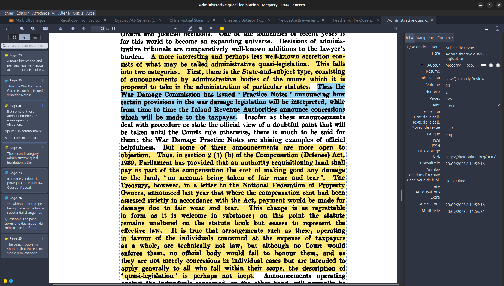

Je ne cesse de louer Zotero. Partout où je vais, je répète à l’envi, à qui veut l’entendre, que Zotero est l’outil le plus utile pour la recherche – et que sans lui, je serais sans doute incapable de garder la trace de tout ce que je consulte avec rigueur et méthode. 

Mais Zotero n’est pas seulement un excellent gestionnaire de références bibliographiques : il est aussi un excellent organiseur de PDF et un annotateur hors pair. 

À chaque citation enregistrée, il est possible d’associer un ou plusieurs fichiers PDF. Ces fichiers sont, en général, les documents eux-mêmes (articles principalement, livres dans certains cas, archives, décisions de justice, etc.). Cela permet, en plus de limiter l’occupation des dossiers `Téléchargements`de nos ordinateurs, de tout trouver au même endroit, citations et documents. 

Mais ce n’est pas tout : ces documents peuvent être ouverts et **annotés** *dans* Zotero ! Cette fonctionnalité, ajoutée lors de la [dernière grosse mise-à-jour du programme](https://www.zotero.org/blog/zotero-6/), rend le travail de recherche et de lecture beaucoup plus aisé. Nul besoin d’ouvrir un document Word à côté d’Adobe Acrobat (ou votre *pdf viewer* préféré) : tout est centralisé dans Zotero.

(en plus, on peut mettre de jolies couleurs)

Une fois les documents annotés, il est possible de demander au programme de créer une note à partir de ces annotations. 

Il est même possible, avec un peu de préparation, de synchroniser les documents en cours de lecture avec une tablette ou liseuse externe offrant la possibilité d’annoter des documents et d’intégrer le tout dans le logiciel.

Elle est pas belle la recherche avec Zotero ?

--- 

Pour plus d’information, vous pouvez lire le [billet](https://www.zotero.org/blog/zotero-6/) publié par l’équipe de Zotero sur cet outil d’annotation ainsi que le [billet publié sur le blog francophone](https://zotero.hypotheses.org/1129) de Zotero.
