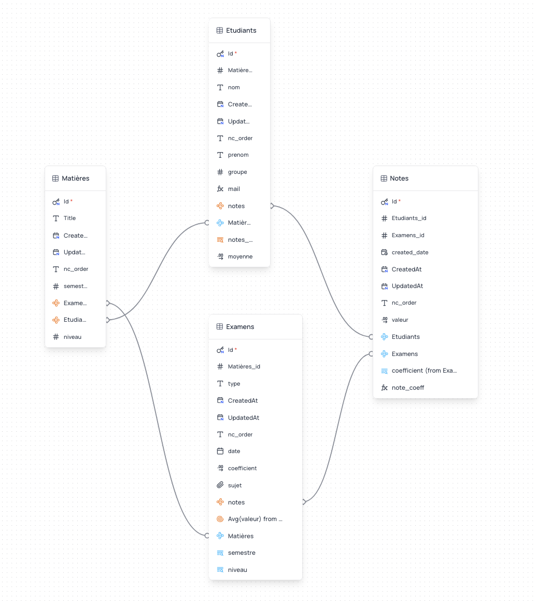

La nouvelle année amène son lot de bonnes résolutions. J'ai un peu délaissé ce blog durant 2024, ce à quoi j'aimerais remédier cette année. Pour cela, je vais me concentrer sur des billets plus courts, me permettant (je l'espère), de publier un peu plus. Stay tuned.

Pour ce premier billet de l'année, j'aimerais partager quelques idées sur l'utilisation des bases de données pour une meilleure gestion (je l'espère aussi) des informations relatives aux groupes de TD que nous avons en tant qu'enseignant•es. 

Depuis que j'ai installé un petit Raspberry Pi à la maison, j'ai tendance à tester un certain nombre d'outils différents pour diverses tâches (to-do list, calendrier, gestion des repas, etc.). Récemment, j'ai essayé [Baserow](https://baserow.io/) (dont avait déjà parlé mon cher ami Jan dans un [billet précédent](https://carnetdethese.amimms.fr/posts/2023/03/base-donnees.md/)) et [NocoDB](https://nocodb.com/). J'ai trouvé NocoDB plus performant et polyvalent, et c'est de cela dont je vais vous parler.

> Un petit disclaimer : cela ne signifie pas que NocoDB est *mieux* dans l'absolu. Comme chaque outil, cela dépend de l'utilisation qu'on en a. En l'occurence, NocoDB est plus adapté à mes besoins.

Depuis que j'ai commencé à enseigner, en 2022, j'ai cherché diverses manières de tenir à jour un tableau organisé et cohérent des étudiants que j'avais sous ma responsabilité. Etant un utilisateur d'Obsidian, j'ai d'abord jeté mon dévolu sur une solution intégrée à ce logiciel, ce qui, à terme, ne m'a pas convaincu. Le problème principal fut que, dans la mesure où Obsidian est un outil de prise de notes, il n'est pas adapté pour l'utilisation que j'essayais d'en faire, à savoir comme un *spreadsheet*. Mauvaise idée. 

J'ai donc utilisé un excel - classique, efficace, mais qui a ses limites pour certains usages. Et puis, ce n'est pas très ✨fun✨. 

Vers octobre dernier, après quelques essais avec NocoDB, j'ai pris la décision de basculer l'intégralité de ma gestion des travaux dirigés sur le logiciel (il tourne sur mon Raspberry Pi, donc toutes les données restent sous mon contrôle). Et là, révélation : en plus de bénéficier d'une synchronisation immédiate avec mes différents appareils, je dispose dorénavant d'une base de donnée cohérente, unique et qui intègre un suivi précis des étudiants sous ma responsabilité durant l'année.

Pour la faire simple, NocoDB propose, comme Baserow, d'une interface très intuitive permettant de créer différentes bases de données *relationnelles* (c'est important pour la suite). Les données insérées dans ces bases peuvent être récupérées via une API relativement facile d'utilisation pour des scripts personnalisés. Je vous présenterai un cas d'usage plus bas.

## Schéma de la base de données relative aux Travaux Dirigés

Quatre tables permettent de stocker toutes les informations nécessaires :

- Dans la table "Matières" se trouvent les différentes matières que j'enseigne. Il y a une colonne pour le niveau (L1, L2, L3...) et le semestre ;
- Dans la table "Examens", les examens (peu importe la matière) auxquels sont soumis les étudiant•es.
    - En outre du type de l'examen et du sujet, j'ai ajouté un lien (une relation) entre cette table et la table "Matières", me permettant ainsi de ne pas avoir à répéter les informations relatives au niveau ou à l'année. Cette table contient aussi une valeur très importante pour la suite : le *coefficient* affecté à l'examen. 
        - Par exemple, les galops d'essai ont quasiment toujours un poids égal à 50% de la note finale. Le coefficient inséré, en décimal, est donc `0.5`, ce qui permettra ensuite le calcul de la note affectée du coefficient pour le calcul de la moyenne ;
- Dans la table "Etudiants" se trouvent bien évidemment la liste des étudiant•es. Ils y sont mélangés, peu importe le niveau, semestre, etc. Chaque ligne contient une colonne "matières", qui est en lien, vous l'aurez compris, avec la table "Matières", permettant ainsi, ici encore, de ne pas avoir à répéter les informations relative au niveau ou au semestre. Cela me permet aussi, si des étudiants restent au second semestre, de ne pas avoir à recréer une ligne avec l'étudiant en question mais de simplement l'ajouter à la matière du second semestre ;
- Dans la table "Notes" sont insérées les notes. Chaque ligne est une note unique, ce qui signifie qu'il y a autant de lignes par étudiant•es qu'il y a d'examens pour la matière. 
    - Il y a une colonne pour la note elle-même, mais aussi une colonne pour la note affectée du coefficient (ex. pour le galop, un 16 sera calculé comme 16 * 0.5, soit 8) afin de calculer, en bout de chaîne, la moyenne. J'ai dû jouer avec les limitations de NocoDB pour faire cela, car le programme ne permet pour l'instant pas de faire des calculs complexes à partir de données récupérées dans d'autres tables. 
    - Dans cette table, j'ai aussi ajouté une colonne "correction" pouvant contenir un fichier. Je corrige beaucoup de devoirs sous format PDF (cela permet d'éviter des impressions inutiles et des risques de perte de feuilles), et cette colonne me permet donc de conserver chaque devoir corrigé en PDF dans la ligne correspondant à la note.

On dit souvent qu'une image vaut mieux que 1000 mots :

## Une utilisation intéressante - mails automatiques

En plus de la simplification dans la gestion des notes que cette base de données permet, on peut en tirer d'autres utilisations intéressantes. En voici une.

Pour le rendu des devoirs envoyés par mail, et la transmission des notes aux étudiants en fin de semestre, il est, avec ~150 étudiant•es, difficilement envisageable de le faire un par un, pour chacune et chacun. J'ai donc écrit un petit script en Python permettant d'automatiser la tâche, en tirant les données de NocoDB. 

Ce script permet, en outre, d'ajouter les devoirs corrigés, lorsqu'ils sont présents, au mail ; de personnaliser le message si l'étudiant•e a obtenu un (demi-)point bonus pour la participation ; d'adapter le message en fonction de la matière concernée. 

Avouons que cette utilisation est intéressante, n'est-ce pas ? 😉

> Pour celles et ceux que ça peut intéresser : je mettrai le script sur un repo github prochainement si cela vous intéresse. 

A bientôt !